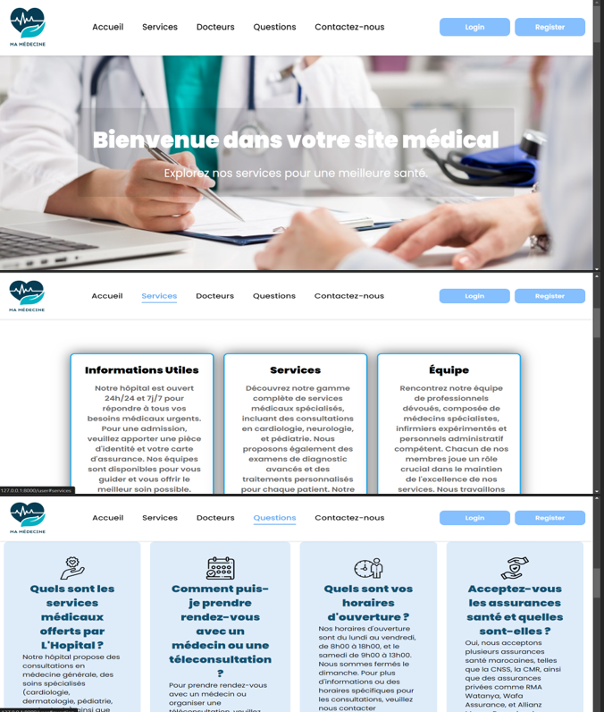
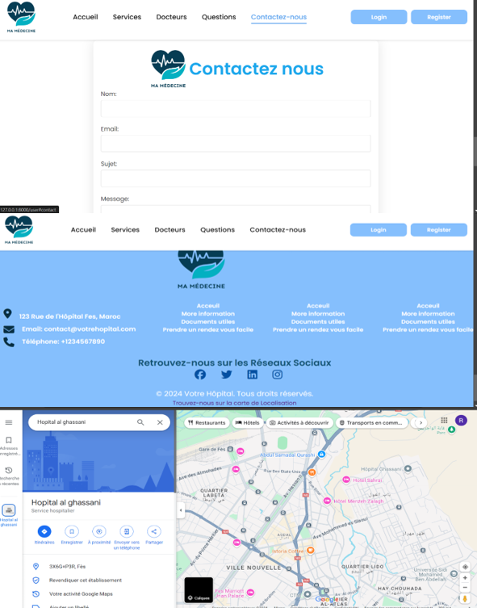
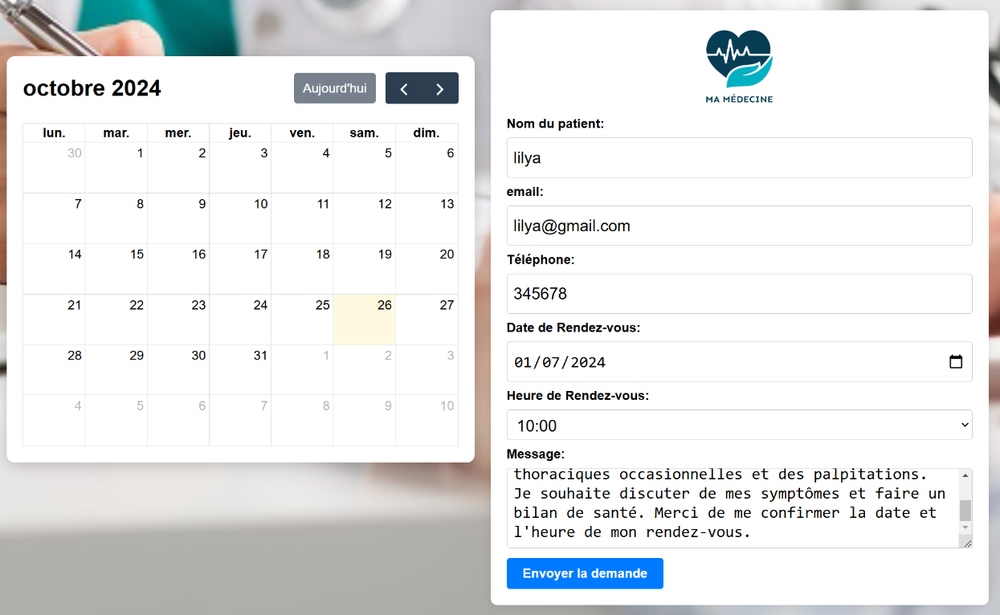
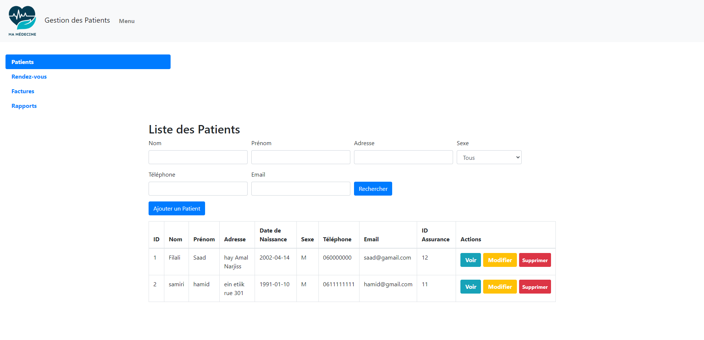
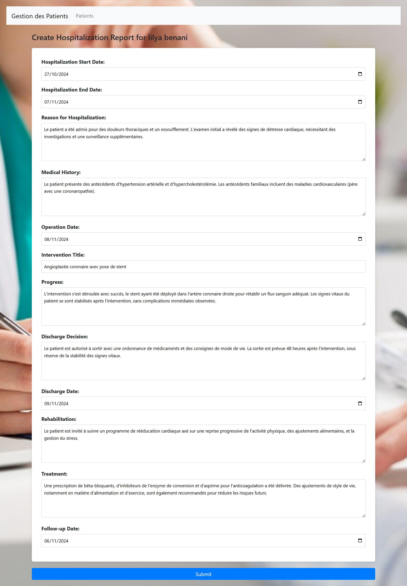
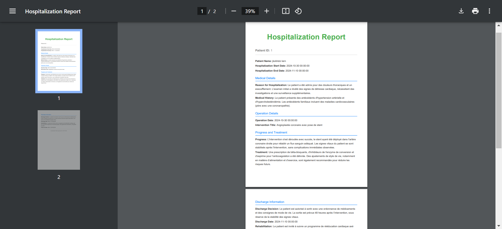

# 🏥 Application de Digitalisation des Services Hospitaliers

Application web développée pour l'Hôpital Ghassani à Fès dans le cadre de mon stage à l'ENSIAS.

## 🚀 Fonctionnalités
- 🔐 Gestion des utilisateurs (médecins, secrétaires, patients)
- 📅 Prise de rendez-vous en ligne
- 👨‍⚕️ Gestion des patients (CRUD)
- 📝 Rapports médicaux (PDF)
- 💳 Génération de factures

## ⚙️ Technologies utilisées
**Backend :** PHP/Laravel, MySQL, phpMyAdmin, XAMPP  
**Frontend :** HTML/CSS/JS, Bootstrap  
**Outils :** Git, DomPDF

---

## 📸 Aperçu de l'application

### Page d'accueil


### Prise de rendez-vous

### Gestion des patients


### Rapport médical PDF


## 🚀 Installation

1. **Cloner le projet**
```bash
git clone [URL_DU_REPOSITORY]
```

2. **Installer les dépendances**
```bash
composer install
```

3. **Configuration**
```bash
cp .env.example .env
php artisan key:generate
```

4. **Base de données** (configurer `.env` puis)
```bash
php artisan migrate
php artisan db:seed
```

5. **Lancer l'application**
```bash
php artisan serve
```

---

## 👩‍💻 Auteur

**Ranya SERRAJ ANDALOUSSI** - ENSIAS (1ère année)  
Encadrante : MEZZAT Tasnime

📧 [ranyaserraj18@gmail.com](mailto:ranyaserraj18@gmail.com) | 🔗 [LinkedIn](https://www.linkedin.com/in/ranya-serraj/)
